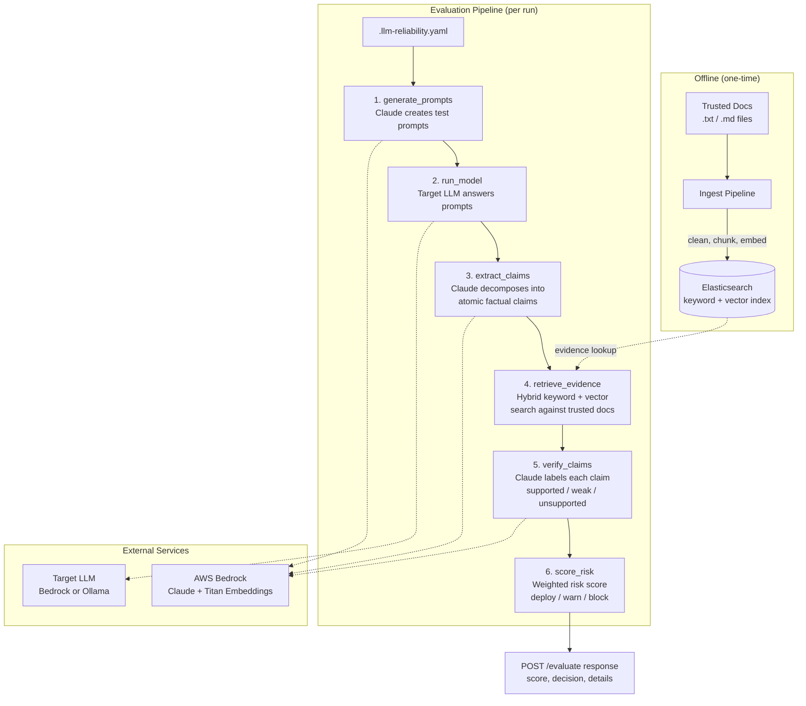

# LLM Reliability Gate

> **Live Demo** -- **[GitHub Actions Runs](https://github.com/kunalsinghdadhwal/llm-reliability-test/actions)** | **[Example Successful Run](https://github.com/kunalsinghdadhwal/llm-reliability-test/actions/runs/22034413683)**

A hallucination detection and scoring system for Large Language Models. It treats LLM output as untrusted input, extracts factual claims, retrieves evidence from pre-indexed trusted documentation, and produces a risk score with a deploy/warn/block decision.

Built for CI/CD integration -- run it as a gate before deploying any LLM-powered feature.

## How It Works

The system runs a six-step sequential pipeline. Each step is an independent agent function that reads from and writes to a shared state dictionary. The orchestrator is a for-loop.



**Scoring formula:**

```
risk = (unsupported_claims * 1.0 + weakly_supported_claims * 0.5) / total_claims
```

- `deploy` -- risk <= deploy_threshold (default 0.10)
- `warn` -- risk between deploy and warn thresholds (default 0.25)
- `block` -- risk > warn_threshold

## Quickstart

### Prerequisites

- Python 3.11+
- Elasticsearch 8.x (local or remote)
- AWS credentials with Bedrock access (Claude + Titan Embeddings)

### Setup

```bash
# Clone and install
git clone <repo-url> && cd symmetrical-broccoli
python -m venv .venv && source .venv/bin/activate
make dev

# Start Elasticsearch locally
docker compose -f docker-compose.test.yml up -d

# Create your config (or use the example)
cp .llm-reliability.yaml my-config.yaml
# Edit my-config.yaml with your use case, doc paths, thresholds

# Index your trusted documentation
python -m src.ingest.pipeline --config my-config.yaml

# Run the API server
uvicorn src.api:app --host 0.0.0.0 --port 8000
```

### Evaluate

```bash
curl -X POST http://localhost:8000/evaluate \
  -H "Content-Type: application/json" \
  -d '{"config_path": "my-config.yaml"}'
```

Response:

```json
{
  "score": 0.15,
  "decision": "warn",
  "total_claims": 12,
  "supported": 8,
  "unsupported": 1,
  "weakly_supported": 3,
  "details": [
    {
      "claim": "Returns are accepted within 30 days of purchase.",
      "label": "supported",
      "justification": "Evidence directly confirms the 30-day return policy."
    }
  ]
}
```

## Configuration

Create a `.llm-reliability.yaml` file (or pass a custom path to the API):

```yaml
use_case: "customer support chatbot for Acme Corp"

risk_tolerance:
  deploy_threshold: 0.10
  warn_threshold: 0.25

evaluation:
  num_prompts: 20
  prompt_categories:
    - factual_recall
    - edge_cases
    - policy_boundaries
    - ambiguous_queries

doc_sources:
  - type: local
    path: ./docs/policies/

model:
  provider: bedrock                                     # or "ollama" for local testing
  model_id: "anthropic.claude-3-sonnet-20240229-v1:0"

elasticsearch:
  host: "http://localhost:9200"
  index: "trusted_docs"
```

| Field | Purpose |
|---|---|
| `use_case` | Plain-English description of the LLM application. Used to generate relevant test prompts. |
| `risk_tolerance.deploy_threshold` | Maximum risk score to auto-approve deployment. |
| `risk_tolerance.warn_threshold` | Maximum risk score before blocking deployment. Between deploy and warn triggers a warning. |
| `evaluation.num_prompts` | Number of test prompts generated per run. |
| `evaluation.prompt_categories` | Categories of prompts to generate (factual_recall, edge_cases, policy_boundaries, ambiguous_queries). |
| `doc_sources` | List of trusted document sources. Currently supports `local` (filesystem paths, reads `.txt` and `.md` recursively). S3 is not yet implemented. |
| `model.provider` | `bedrock` for production (AWS), `ollama` for local testing. |
| `model.model_id` | The model identifier for the target LLM being evaluated. |
| `elasticsearch.host` | Elasticsearch URL. |
| `elasticsearch.index` | Index name for trusted documents. Created during ingest if it does not exist. |

## API

### `POST /evaluate`

Runs the full pipeline and returns the risk assessment.

**Request body:**
```json
{ "config_path": "path/to/config.yaml" }
```

`config_path` is optional. Defaults to `.llm-reliability.yaml` in the working directory.

**Response:** `200` with score, decision, claim counts, and per-claim details (see example above).

**Errors:**
- `400` -- invalid or malformed config
- `404` -- config file not found

### `GET /health`

Returns `{"status": "ok"}`.

## CI/CD Integration

The included GitHub Actions workflow (`.github/workflows/llm-reliability.yml`) runs the gate on every pull request to `main`:

1. Starts the API server with AWS and Elasticsearch credentials from repository secrets
2. Calls `POST /evaluate`
3. Reads the `decision` field:
   - `block` -- fails the workflow, PR cannot merge
   - `warn` -- annotates the PR with a warning, workflow passes
   - `deploy` -- clean pass

Required repository secrets: `AWS_ACCESS_KEY_ID`, `AWS_SECRET_ACCESS_KEY`, `AWS_DEFAULT_REGION`, `ES_HOST`.

## Pipeline Agents

Each agent is a single function with the signature `(state: dict) -> None`. They communicate only through the shared state dictionary.

| Step | Agent | Reads | Writes | Calls |
|---|---|---|---|---|
| 1 | `generate_prompts` | `config` (use_case, evaluation settings) | `prompts` (list of test strings) | Claude via Bedrock |
| 2 | `run_model` | `prompts`, `config.model` | `responses` (prompt/response pairs) | Target LLM (Bedrock or Ollama) |
| 3 | `extract_claims` | `responses` | `claims` (atomic facts with traceability) | Claude via Bedrock |
| 4 | `retrieve_evidence` | `claims`, `config.elasticsearch` | `evidence` (claim + matched docs) | Elasticsearch (keyword + kNN) |
| 5 | `verify_claims` | `evidence` | `verdicts` (label + justification per claim) | Claude via Bedrock |
| 6 | `score_risk` | `verdicts`, `config.thresholds` | `score` (risk, decision, counts) | None (pure computation) |

### Why dual search in retrieve_evidence

Each claim is searched two ways:

- **Keyword (BM25)** -- catches exact terms like product names, policy numbers, dates
- **Vector (kNN)** -- catches semantic matches, e.g. "return policy" finds "Refund and Exchange Guidelines"

Results are combined and deduplicated (first occurrence wins).

### Why sequential over async

The pipeline runs agents in a simple for-loop. This is intentional:

- **Deterministic** -- same config produces the same execution path
- **Debuggable** -- sequential logs are trivial to trace
- **Simple** -- the orchestrator is 15 lines of code
- **Sufficient** -- evaluation is a batch job, not a real-time system

## Ingest Pipeline

Before running evaluations, index your trusted documentation:

```bash
python -m src.ingest.pipeline --config .llm-reliability.yaml
```

This reads every `.txt` and `.md` file under the configured `doc_sources` paths, then for each file:

1. **Clean** -- strips HTML tags, normalizes whitespace
2. **Chunk** -- splits into 500-word chunks with 50-word overlap
3. **Embed** -- generates a vector embedding via Titan Text Embeddings V2
4. **Index** -- stores content + embedding in Elasticsearch (doc ID is SHA256 of chunk text)

Run this once, or re-run whenever your trusted documentation changes.

## Environment Variables

| Variable | Default | Purpose |
|---|---|---|
| `AWS_DEFAULT_REGION` | `us-east-1` | AWS region for Bedrock |
| `AWS_ACCESS_KEY_ID` | -- | AWS credential |
| `AWS_SECRET_ACCESS_KEY` | -- | AWS credential |
| `BEDROCK_MODEL_ID` | `anthropic.claude-3-sonnet-20240229-v1:0` | Override the Claude model used for prompt generation, claim extraction, and verification |
| `TITAN_MODEL_ID` | `amazon.titan-embed-text-v2:0` | Override the embedding model |
| `ES_HOST` | `http://localhost:9200` | Elasticsearch URL |
| `ES_API_KEY` | -- | Elasticsearch API key (optional, for authenticated clusters) |
| `OLLAMA_HOST` | `http://localhost:11434` | Ollama URL (only used when `model.provider` is `ollama`) |

## Development

```bash
# Install dev dependencies
make dev

# Run unit tests (125 tests, no external services needed)
make test

# Lint
make lint

# Auto-format
make format

# Type check
make typecheck

# Start local Elasticsearch for integration tests
docker compose -f docker-compose.test.yml up -d

# Install pre-commit hooks
pre-commit install
```

### Running with Ollama (local, no AWS needed)

For local development and testing without AWS credentials, use Ollama as the target LLM provider:

1. Install [Ollama](https://ollama.com) and pull a model: `ollama pull llama3.2`
2. Set `model.provider: ollama` and `model.model_id: llama3.2` in your config
3. Note: the prompt generation, claim extraction, and verification steps still use Claude via Bedrock. Ollama replaces only the target LLM being evaluated (step 2).

## Design Decisions

**LLM output is untrusted input.** The system never takes an LLM response at face value. Every factual claim is extracted, matched against evidence, and independently verified.

**Separation of concerns between generation and verification.** Even though Claude is used for both generating test prompts and verifying claims, each invocation is independent with no shared conversational context. The verifier cannot be influenced by the generator.

**Elasticsearch as the evidence store.** Dense vector search (kNN) handles semantic similarity. BM25 keyword search handles exact matching. The combination reduces false negatives in evidence retrieval.

**Config-driven thresholds.** What counts as "acceptable risk" varies by use case. A medical chatbot might set `deploy_threshold: 0.02`. A casual FAQ bot might tolerate `deploy_threshold: 0.15`. The system does not impose policy -- it provides measurements.

**No hidden state.** The shared state dictionary is the single source of truth. Every agent reads from it and writes to it. There is no implicit memory, no side channels, no global variables carrying information between agents.
