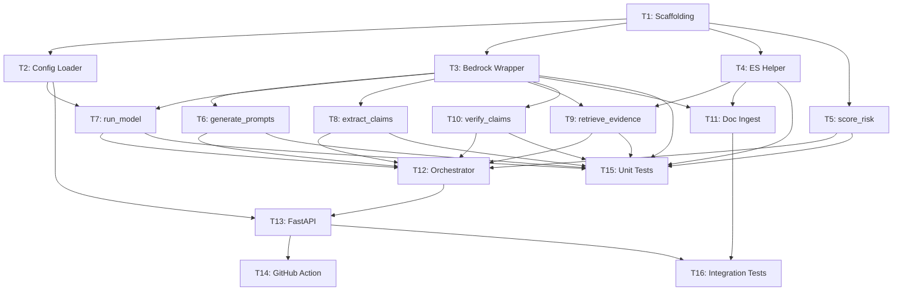

# TASKS -- LLM Reliability Gate

Each task is a self-contained agent prompt in `tasks/`. Point an agent at the file and it has everything it needs.

---

## Worktree Setup

```bash
# 1. Complete T1 on main first (tasks/T01-project-scaffolding.md)

# 2. Create worktrees for parallel tasks
git worktree add ../t2-config-loader     -b task/t2-config-loader
git worktree add ../t3-bedrock-wrapper   -b task/t3-bedrock-wrapper
git worktree add ../t4-es-helper         -b task/t4-es-helper
git worktree add ../t5-score-risk        -b task/t5-score-risk
git worktree add ../t6-gen-prompts       -b task/t6-gen-prompts
git worktree add ../t7-run-model         -b task/t7-run-model
git worktree add ../t8-extract-claims    -b task/t8-extract-claims
git worktree add ../t9-retrieve-evidence -b task/t9-retrieve-evidence
git worktree add ../t10-verify-claims    -b task/t10-verify-claims
git worktree add ../t11-doc-ingest       -b task/t11-doc-ingest

# 3. Spawn an agent in a worktree
cd ../t3-bedrock-wrapper
claude "$(cat ../symmetrical-broccoli/tasks/T03-bedrock-wrapper.md)"
```

## Merge Order

```
main <-- T2, T3, T4, T5    (parallel, no file conflicts)
     <-- T6-T11             (parallel, no file conflicts)
     <-- T12                (imports all agents)
     <-- T13                (imports orchestrator + config)
     <-- T14, T15, T16      (CI + tests)
```

---

## Dependency Graph



---

## Task Index

| File | Task | Phase | Depends On | Parallel With |
|------|------|-------|------------|---------------|
| [T01](tasks/T01-project-scaffolding.md) | Project Scaffolding | 1 | -- | -- |
| [T02](tasks/T02-config-loader.md) | Config Loader | 1 | T1 | T3, T4, T5 |
| [T03](tasks/T03-bedrock-wrapper.md) | Bedrock Wrapper | 1 | T1 | T2, T4, T5 |
| [T04](tasks/T04-elasticsearch-helper.md) | Elasticsearch Helper | 1 | T1 | T2, T3, T5 |
| [T05](tasks/T05-score-risk.md) | score_risk Agent | 1 | T1 | T2, T3, T4 |
| [T06](tasks/T06-generate-prompts.md) | generate_prompts Agent | 2 | T3 | T7-T11 |
| [T07](tasks/T07-run-model.md) | run_model Agent | 2 | T2, T3 | T6, T8-T11 |
| [T08](tasks/T08-extract-claims.md) | extract_claims Agent | 2 | T3 | T6, T7, T9-T11 |
| [T09](tasks/T09-retrieve-evidence.md) | retrieve_evidence Agent | 2 | T3, T4 | T6-T8, T10, T11 |
| [T10](tasks/T10-verify-claims.md) | verify_claims Agent | 2 | T3 | T6-T9, T11 |
| [T11](tasks/T11-doc-ingest.md) | Doc Ingest Pipeline | 2 | T3, T4 | T6-T10 |
| [T12](tasks/T12-orchestrator.md) | Workflow Orchestrator | 3 | T5-T10 | -- |
| [T13](tasks/T13-fastapi-backend.md) | FastAPI Backend | 3 | T2, T12 | -- |
| [T14](tasks/T14-github-action.md) | GitHub Action | 3 | T13 | T15, T16 |
| [T15](tasks/T15-unit-tests.md) | Unit Tests (gap fill) | 3 | T3-T10 | T14, T16 |
| [T16](tasks/T16-integration-tests.md) | Integration Tests | 3 | T11, T13 | T14, T15 |

---

## Interface Contracts

Every task codes against these signatures. This is the integration surface.

### State Dictionary

```python
state: dict = {
    "config": {
        "use_case": str,
        "thresholds": {"deploy": float, "warn": float},
        "evaluation": {"num_prompts": int, "prompt_categories": list[str]},
        "model": {"provider": str, "model_id": str},
        "elasticsearch": {"host": str, "index": str},
        "doc_sources": list[dict],
    },
    "prompts": list[str],
    "responses": list[dict],    # [{"prompt": str, "response": str}]
    "claims": list[dict],       # [{"text": str, "source_prompt": str, "source_response": str}]
    "evidence": list[dict],     # [{"claim": dict, "documents": list[dict]}]
    "verdicts": list[dict],     # [{"claim": str, "label": str, "justification": str}]
    "score": {"risk": float, "decision": str, "total_claims": int,
              "supported": int, "weakly_supported": int, "unsupported": int},
}
```

### Function Signatures

```python
# src/config/loader.py
def load_config(path: str | None = None) -> dict: ...

# src/wrappers/bedrock.py
def call_llm(prompt: str, system: str = "") -> str: ...
def embed(text: str) -> list[float]: ...

# src/wrappers/elasticsearch_helper.py
def index_doc(index: str, doc_id: str, body: dict) -> None: ...
def search_docs(query: str, index: str = "trusted_docs") -> list[dict]: ...
def vector_search(text: str, index: str = "trusted_docs", k: int = 5) -> list[dict]: ...

# src/agents/*.py -- all have the same signature
def generate_prompts(state: dict) -> None: ...
def run_model(state: dict) -> None: ...
def extract_claims(state: dict) -> None: ...
def retrieve_evidence(state: dict) -> None: ...
def verify_claims(state: dict) -> None: ...
def score_risk(state: dict) -> None: ...

# src/orchestrator.py
def run_workflow(state: dict) -> None: ...
def build_response(state: dict) -> dict: ...

# src/ingest/pipeline.py
def run_ingest(config_path: str) -> dict: ...
```
