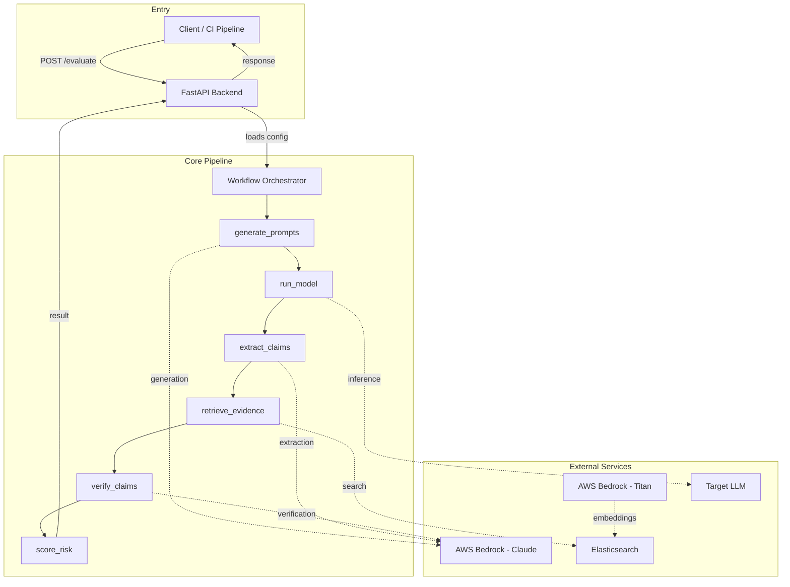
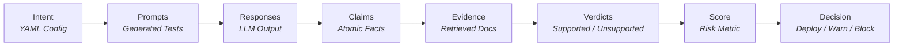
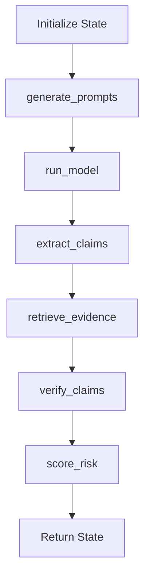
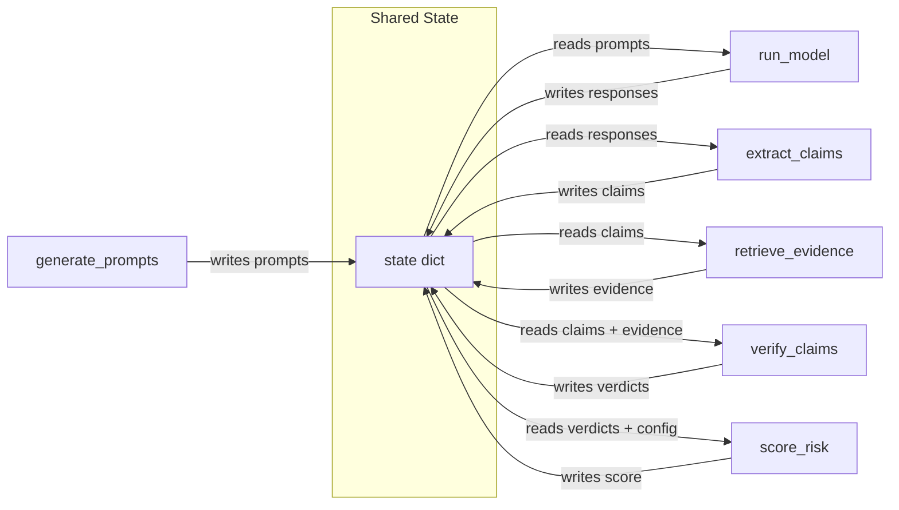
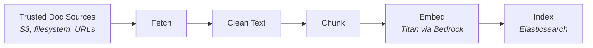
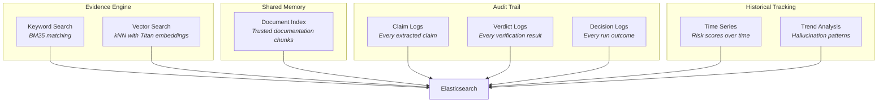
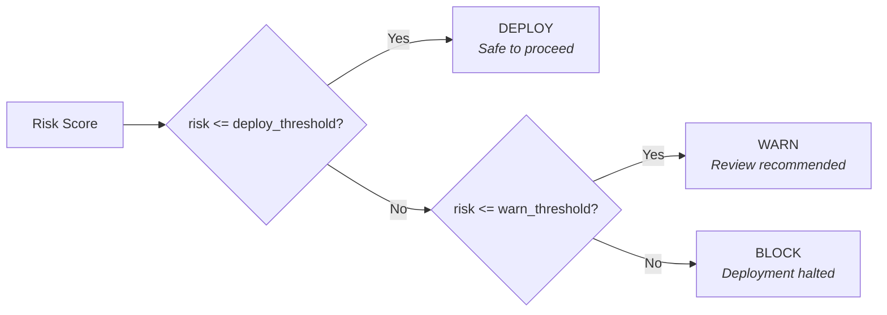
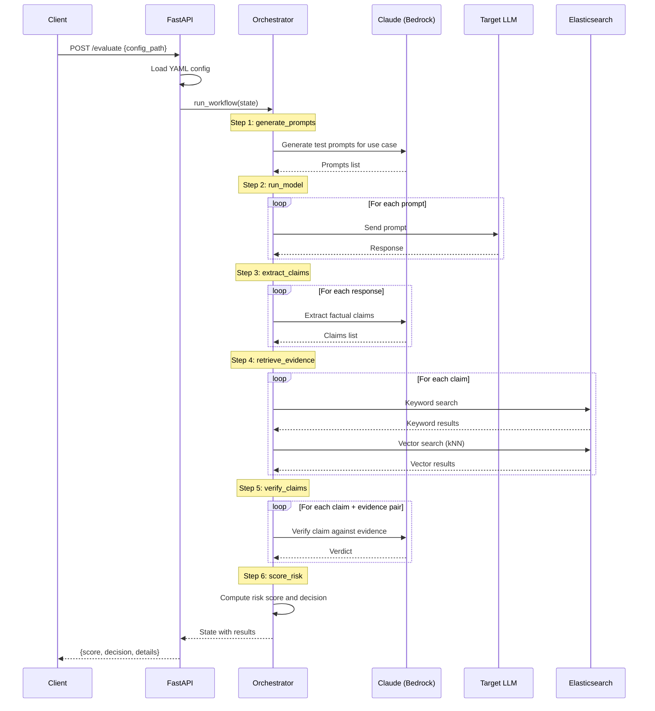
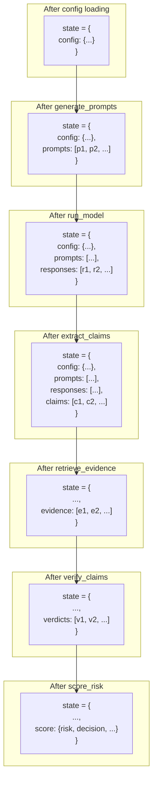

# ARCHITECTURE.md

## LLM Reliability Gate

A structured, repeatable, and auditable system for detecting and scoring hallucinations in Large Language Model outputs before they reach production.

---

## Table of Contents

- [1. Introduction and Problem Statement](#1-introduction-and-problem-statement)
- [2. High-Level System Overview](#2-high-level-system-overview)
- [3. Core Design Rules and Philosophy](#3-core-design-rules-and-philosophy)
- [4. Mental Model and Pipeline](#4-mental-model-and-pipeline)
- [5. System Components](#5-system-components)
  - [5.1 FastAPI Backend](#51-fastapi-backend)
  - [5.2 Workflow Orchestrator](#52-workflow-orchestrator)
  - [5.3 Agents](#53-agents)
  - [5.4 Bedrock Wrapper](#54-bedrock-wrapper)
  - [5.5 Elasticsearch Helper](#55-elasticsearch-helper)
  - [5.6 Documentation Ingest](#56-documentation-ingest)
  - [5.7 Config File (.llm-reliability.yaml)](#57-config-file-llm-reliabilityyaml)
  - [5.8 GitHub Action](#58-github-action)
- [6. Elasticsearch's Central Role](#6-elasticsearchs-central-role)
- [7. Hallucination Definition and Scoring](#7-hallucination-definition-and-scoring)
- [8. Evaluation Workflow: Step-by-Step](#8-evaluation-workflow-step-by-step)
- [9. Data Flow and Shared State](#9-data-flow-and-shared-state)
- [10. Security Considerations](#10-security-considerations)
- [11. Scalability and Performance](#11-scalability-and-performance)
- [12. Extensibility](#12-extensibility)
- [13. Testing Strategy](#13-testing-strategy)
- [14. Known Limitations](#14-known-limitations)
- [15. Future Enhancements](#15-future-enhancements)
- [16. References](#16-references)

---

## 1. Introduction and Problem Statement

Large Language Models (LLMs) hallucinate. They generate text that reads fluently and sounds authoritative but contains factual claims that are incorrect, unsubstantiated, or entirely fabricated. In casual applications this is a nuisance. In production systems -- customer support, compliance workflows, documentation answers, policy enforcement -- it is a liability.

Most teams address this with ad-hoc testing: a handful of manual checks before deployment, an occasional review of outputs, or a vague sense that "it seems to work." There is no structured process, no repeatable methodology, and no audit trail.

The LLM Reliability Gate transforms hallucination detection into a formal, repeatable, auditable process. It is the equivalent of CI/CD testing applied to LLM output quality. Given a YAML configuration that defines a company's LLM use case, the system:

1. Generates domain-specific test prompts.
2. Runs those prompts against the target model.
3. Extracts factual claims from the responses.
4. Retrieves trusted documentation as evidence.
5. Verifies each claim against that evidence.
6. Scores the overall hallucination risk.
7. Outputs a decision: **deploy**, **warn**, or **block**.

Every step is logged. Every decision is traceable. Every run is reproducible.

---

## 2. High-Level System Overview

The system is a linear pipeline, not a chat application, not a multi-agent conversation, and not a retrieval-augmented generation (RAG) system. It is a testing harness that treats LLM output as untrusted input and verifies it against stored, trusted documentation.



**Caption:** High-level component overview. The FastAPI backend receives evaluation requests and delegates to the Workflow Orchestrator. The orchestrator steps through six agents sequentially. Agents interact with AWS Bedrock (Claude for reasoning, Titan for embeddings), the target LLM under test, and Elasticsearch for evidence retrieval. Results flow back through FastAPI to the caller.

Key architectural boundaries:

| Layer | Responsibility | Does NOT do |
|---|---|---|
| FastAPI Backend | HTTP interface, config loading, orchestration invocation | LLM calls, search queries, business logic |
| Workflow Orchestrator | Sequential agent execution, shared state management | Direct I/O, external API calls |
| Agents | Single-purpose transforms on shared state | Cross-agent communication, self-verification |
| Bedrock Wrapper | LLM and embedding API calls | Retries, streaming, caching |
| Elasticsearch Helper | Document storage, keyword search, vector search | Business logic, scoring |

---

## 3. Core Design Rules and Philosophy

### 3.1 What the System Does NOT Do

These are not aspirational constraints. They are hard rules that shape every design decision:

- **No chatbot behavior.** The system does not maintain conversational state, does not respond to follow-up questions, and does not attempt to be helpful in a conversational sense. It runs a pipeline and returns a result.

- **No live web browsing.** Verification is performed exclusively against pre-indexed, trusted documentation. The system never fetches live data during evaluation.

- **No self-verification.** An LLM never verifies its own output. The model that generates claims is never the same invocation that verifies them. Separation of generation and verification is enforced structurally.

- **No hidden memory or state.** Every piece of data flows through the explicit shared state dictionary. There are no side channels, no implicit context, and no accumulated session state between evaluation runs.

- **No complex multi-agent conversations.** Agents do not talk to each other. They read from shared state, do their work, and write back. There is no negotiation, no consensus, and no agent-to-agent messaging.

### 3.2 What the System DOES Do

- **Treats LLM output as untrusted.** Every claim extracted from an LLM response is assumed to be potentially false until verified against evidence.

- **Verifies claims solely against stored documentation.** The boundary of "truth" is explicitly defined by the configuration file. The system does not attempt to judge universal truth.

- **Keeps agents simple and single-purpose.** Each agent is a plain function with one job. No classes, no inheritance hierarchies, no polymorphism.

- **Uses Elasticsearch as the central truth engine.** All evidence retrieval, audit logging, and historical tracking goes through Elasticsearch. It is the single source of ground truth.

- **Ensures integrations are fast and minimal.** The Bedrock wrapper exposes two functions. The Elasticsearch helper exposes three functions. There is no abstraction layer over abstraction layers.

### 3.3 Design Philosophy

The system is optimized for four properties, in this order:

1. **Clarity.** Every component does one thing. Every data flow is explicit. A new developer can read the orchestrator and understand the entire system in minutes.

2. **Debuggability.** When a claim is marked "unsupported," you can trace exactly which evidence was retrieved, which prompt was used for verification, and what the verifier model returned. Nothing is hidden.

3. **Fast integration.** The system is a single POST endpoint. It reads a YAML file. It returns JSON. Integration into any CI/CD pipeline takes minutes.

4. **Reliability.** Sequential execution with no async complexity. No race conditions. No distributed coordination. The pipeline either completes or it fails, and the failure is always attributable to a specific step.

### 3.4 Why Sequential Over Async

The orchestrator executes agents one at a time. This is deliberate:

- **Determinism.** Given the same config and the same model behavior, the pipeline produces the same result. Async execution introduces non-deterministic ordering.
- **Debuggability.** A sequential trace is trivially readable. Async traces require correlation IDs, timestamps, and careful reconstruction.
- **Simplicity.** The orchestrator is a for-loop. There are no task queues, no worker pools, no event loops, and no callback chains.
- **Acceptable performance.** An evaluation run is not a real-time operation. It runs in CI/CD or on-demand. A few seconds of sequential execution is not a bottleneck.

---

## 4. Mental Model and Pipeline

The system follows a strict linear pipeline. Each stage transforms the shared state and passes it to the next.



**Caption:** The evaluation pipeline. Blue stages involve generation (Claude). Yellow stages involve the target LLM and claim extraction. Green involves Elasticsearch retrieval. Red stages involve verification and scoring. Purple is the final output.

Each stage maps to exactly one agent function. The mapping is:

| Pipeline Stage | Agent Function | External Dependency |
|---|---|---|
| Intent | (config loading) | Filesystem |
| Prompts | `generate_prompts` | Claude via Bedrock |
| Responses | `run_model` | Target LLM (or Ollama for testing) |
| Claims | `extract_claims` | Claude via Bedrock |
| Evidence | `retrieve_evidence` | Elasticsearch |
| Verdicts | `verify_claims` | Claude via Bedrock |
| Score + Decision | `score_risk` | None (pure computation) |

---

## 5. System Components

### 5.1 FastAPI Backend

**Purpose:** HTTP entry point for the system. Accepts evaluation requests, loads configuration, invokes the workflow, and returns results.

**What it does:**
- Exposes a `POST /evaluate` endpoint.
- Loads the `.llm-reliability.yaml` config file.
- Constructs the initial shared state dictionary.
- Calls the workflow orchestrator.
- Returns the final result as JSON.

**What it does NOT do:**
- Call LLMs directly.
- Query Elasticsearch.
- Contain scoring logic, claim extraction, or any business logic.

The backend is a pure glue layer. It translates HTTP into function calls and function results back into HTTP.

```python
from fastapi import FastAPI
from pydantic import BaseModel

app = FastAPI()


class EvaluateRequest(BaseModel):
    config_path: str | None = None


class EvaluateResponse(BaseModel):
    score: float
    decision: str  # "deploy", "warn", or "block"
    total_claims: int
    supported: int
    unsupported: int
    weakly_supported: int
    details: list[dict]


@app.post("/evaluate")
async def evaluate(request: EvaluateRequest) -> EvaluateResponse:
    config = load_config(request.config_path)
    state = {"config": config}
    run_workflow(state)
    return build_response(state)
```

**Design rationale:** FastAPI was chosen for its type-safe request/response handling via Pydantic, automatic OpenAPI documentation generation, and minimal boilerplate. The endpoint is async-compatible but the workflow itself runs synchronously -- the `async def` is a FastAPI convention that does not imply internal concurrency. The Pydantic models enforce a contract: the caller knows exactly what to send and what to expect back.

### 5.2 Workflow Orchestrator

**Purpose:** Executes the pipeline. Steps through agents sequentially, passing the shared state dictionary to each one.



**Caption:** Workflow orchestrator execution order. Blue agents use Claude via Bedrock. Green agents interact with external systems (target LLM, Elasticsearch). Yellow is pure computation.

The orchestrator is intentionally minimal:

```python
def run_workflow(state: dict) -> None:
    agents = [
        generate_prompts,
        run_model,
        extract_claims,
        retrieve_evidence,
        verify_claims,
        score_risk,
    ]
    for agent in agents:
        agent(state)
```

**Design rationale:** The orchestrator is a for-loop over a list of functions. This is the simplest possible implementation of sequential pipeline execution. Each agent mutates the shared `state` dictionary in place and returns nothing. There is no return value to check, no exception hierarchy to manage (beyond standard Python exceptions), and no control flow beyond "run each function in order."

This design makes the system trivially testable: you can call any agent in isolation by constructing the appropriate state dictionary. You can also insert logging, timing, or validation between steps by wrapping the loop.

**Shared state structure:**

```python
state = {
    "config": {
        "use_case": "customer support chatbot",
        "risk_tolerance": 0.15,
        "doc_sources": ["s3://company-docs/support/"],
        "num_prompts": 20,
        "thresholds": {
            "deploy": 0.10,
            "warn": 0.25,
        }
    },
    "prompts": [],       # Populated by generate_prompts
    "responses": [],     # Populated by run_model
    "claims": [],        # Populated by extract_claims
    "evidence": [],      # Populated by retrieve_evidence
    "verdicts": [],      # Populated by verify_claims
    "score": {},         # Populated by score_risk
}
```

Each agent reads the keys it needs and writes to its designated key. No agent reads a key that has not been written by a prior agent. This ordering invariant is enforced by the sequential execution.

### 5.3 Agents

Agents are plain functions. They are not classes. They do not inherit from a base class. They do not implement an interface. They are functions that take a state dictionary, do one thing, and write results back into the state.



**Caption:** Agent-state interaction pattern. Every agent reads from and writes to the shared state dictionary. Agents never communicate directly with each other.

#### 5.3.1 generate_prompts

**Reads:** `state["config"]`
**Writes:** `state["prompts"]`
**External dependency:** Claude via Bedrock

Takes the use-case description and domain context from the config and generates a set of domain-specific test prompts. These prompts are designed to probe the target LLM in ways that are likely to surface hallucinations: edge cases, ambiguous questions, requests for specific facts, and queries about boundaries of the documented domain.

The prompt generation itself uses Claude (via Bedrock's Converse API) because generating good test prompts requires understanding the domain and anticipating failure modes.

```python
def generate_prompts(state: dict) -> None:
    config = state["config"]
    system_prompt = (
        "Generate test prompts for an LLM used as a "
        f"{config['use_case']}. "
        "Focus on questions likely to surface hallucinations."
    )
    response = call_llm(system_prompt)
    state["prompts"] = parse_prompts(response)
```

#### 5.3.2 run_model

**Reads:** `state["prompts"]`
**Writes:** `state["responses"]`
**External dependency:** Target LLM

Runs each generated prompt against the target LLM -- the model being evaluated for production readiness. The system is agnostic to which model is being tested; it only requires a callable interface.

In production, this calls the company's deployed model. During system development and testing, Ollama can substitute as the target to simulate a hallucination-prone model in a controlled, local, reproducible environment.

```python
def run_model(state: dict) -> None:
    prompts = state["prompts"]
    responses = []
    for prompt in prompts:
        response = call_target_llm(prompt)
        responses.append({
            "prompt": prompt,
            "response": response,
        })
    state["responses"] = responses
```

**Ollama for testing (non-production):** During development of the Reliability Gate itself, Ollama provides a local LLM that can be configured to produce varying levels of accuracy. This lets developers validate that the pipeline correctly detects hallucinations without requiring access to a production model. The Ollama Python client provides a straightforward interface:

```python
from ollama import Client

# Testing only -- not part of production architecture
client = Client(host="http://localhost:11434")
response = client.chat(
    model="llama3.2",
    messages=[{"role": "user", "content": prompt}],
)
return response.message.content
```

#### 5.3.3 extract_claims

**Reads:** `state["responses"]`
**Writes:** `state["claims"]`
**External dependency:** Claude via Bedrock

Takes each LLM response and decomposes it into atomic factual claims. A single response like "Our return policy allows returns within 30 days, and shipping is free for orders over $50" becomes two claims:

1. "The return policy allows returns within 30 days."
2. "Shipping is free for orders over $50."

This decomposition is necessary because a response can be partially correct. Scoring at the response level would lose this granularity.

Claude is used for extraction because identifying claim boundaries, distinguishing facts from opinions, and handling hedged language requires strong language understanding.

#### 5.3.4 retrieve_evidence

**Reads:** `state["claims"]`
**Writes:** `state["evidence"]`
**External dependency:** Elasticsearch

For each claim, queries Elasticsearch to find relevant trusted documentation. Uses both keyword search (for exact term matching) and vector search (for semantic similarity), combining results for comprehensive retrieval.

```python
def retrieve_evidence(state: dict) -> None:
    claims = state["claims"]
    evidence = []
    for claim in claims:
        keyword_results = search_docs(claim["text"])
        vector_results = vector_search(claim["text"])
        combined = deduplicate(keyword_results + vector_results)
        evidence.append({
            "claim": claim,
            "documents": combined,
        })
    state["evidence"] = evidence
```

The dual-search approach (keyword + vector) is important because:
- **Keyword search** catches exact terminology matches that vector search might miss (e.g., product names, policy numbers, specific dates).
- **Vector search** catches semantic matches that keyword search would miss (e.g., "return policy" matching documentation titled "Refund and Exchange Guidelines").

#### 5.3.5 verify_claims

**Reads:** `state["claims"]`, `state["evidence"]`
**Writes:** `state["verdicts"]`
**External dependency:** Claude via Bedrock

The core verification step. For each claim-evidence pair, asks Claude whether the claim is supported by the evidence. Each claim receives one of three labels:

| Verdict | Meaning |
|---|---|
| **Supported** | The claim is directly and clearly supported by the retrieved evidence. |
| **Weakly supported** | The claim is partially supported, or the evidence is ambiguous or tangentially related. |
| **Unsupported** | The claim has no support in the retrieved evidence, or the evidence contradicts it. |

This is where the separation-of-concerns design pays off. The model that generated the claims (the target LLM) is structurally different from the model verifying them (Claude via Bedrock). Even when Claude is both the generator (in `generate_prompts` and `extract_claims`) and the verifier, the invocations are independent: different prompts, different system instructions, and no shared conversational context. The verifier has no memory of what the generator produced -- it only sees the claim text and the evidence documents.

#### 5.3.6 score_risk

**Reads:** `state["verdicts"]`, `state["config"]`
**Writes:** `state["score"]`
**External dependency:** None (pure computation)

Aggregates the verdicts into a single hallucination risk score and produces the final decision. This is the only agent with no external dependencies -- it is pure arithmetic.

```python
def score_risk(state: dict) -> None:
    verdicts = state["verdicts"]
    config = state["config"]
    thresholds = config["thresholds"]

    total = len(verdicts)
    unsupported = sum(1 for v in verdicts if v["label"] == "unsupported")
    weakly = sum(1 for v in verdicts if v["label"] == "weakly_supported")

    # Weighted risk: unsupported counts fully, weakly counts at half
    risk = (unsupported + 0.5 * weakly) / total if total > 0 else 0.0

    if risk <= thresholds["deploy"]:
        decision = "deploy"
    elif risk <= thresholds["warn"]:
        decision = "warn"
    else:
        decision = "block"

    state["score"] = {
        "risk": round(risk, 4),
        "decision": decision,
        "total_claims": total,
        "supported": total - unsupported - weakly,
        "weakly_supported": weakly,
        "unsupported": unsupported,
    }
```

**Design rationale for weighted scoring:** Unsupported claims represent clear hallucinations. Weakly supported claims represent ambiguity -- the model may be correct, but the evidence does not strongly confirm it. Weighting weakly supported claims at 0.5 treats them as half a hallucination, which reflects the uncertainty without over-penalizing the model for edge cases.

The thresholds (`deploy` and `warn`) are defined in the YAML config, making them tunable per organization and per use case. A compliance chatbot might use thresholds of 0.05 / 0.10 (very strict), while an internal knowledge base might accept 0.15 / 0.30.

### 5.4 Bedrock Wrapper

**Purpose:** Encapsulates all communication with AWS Bedrock. Exposes exactly two functions.

```python
import boto3
import json

bedrock_runtime = boto3.client(
    service_name="bedrock-runtime",
    region_name="us-east-1",  # from environment
)


def call_llm(prompt: str, system: str = "") -> str:
    """Invoke Claude via the Converse API for reasoning/generation."""
    messages = [
        {"role": "user", "content": [{"text": prompt}]}
    ]
    system_prompts = [{"text": system}] if system else []

    response = bedrock_runtime.converse(
        modelId="anthropic.claude-3-sonnet-20240229-v1:0",
        messages=messages,
        system=system_prompts,
        inferenceConfig={"maxTokens": 4096, "temperature": 0.0},
    )
    return response["output"]["message"]["content"][0]["text"]


def embed(text: str) -> list[float]:
    """Generate embeddings via Titan Text Embeddings V2."""
    body = json.dumps({"inputText": text})
    response = bedrock_runtime.invoke_model(
        body=body,
        modelId="amazon.titan-embed-text-v2:0",
        accept="application/json",
        contentType="application/json",
    )
    response_body = json.loads(response["body"].read())
    return response_body["embedding"]
```

**Design decisions:**

- **Temperature 0.0 for `call_llm`.** All LLM calls in the pipeline are analytical, not creative. Deterministic output is preferred.
- **No retries.** If Bedrock fails, the pipeline fails. Retries mask transient issues and introduce non-determinism. Failures should be surfaced, investigated, and fixed.
- **No streaming.** The system processes complete responses, not token streams. Streaming adds complexity with no benefit here.
- **No caching.** Each evaluation run should produce fresh results. Caching LLM responses would defeat the purpose of re-evaluation.
- **Credentials via environment variables.** Standard AWS credential chain (`AWS_ACCESS_KEY_ID`, `AWS_SECRET_ACCESS_KEY`, `AWS_DEFAULT_REGION`) or IAM roles when running in AWS infrastructure.

### 5.5 Elasticsearch Helper

**Purpose:** Minimal interface for document storage and retrieval. Three functions, no more.

```python
from elasticsearch import Elasticsearch

es = Elasticsearch(
    cloud_id="YOUR_CLOUD_ID",  # or hosts=["http://localhost:9200"]
    api_key="YOUR_API_KEY",
)


def index_doc(index: str, doc_id: str, body: dict) -> None:
    """Index a document into Elasticsearch."""
    es.index(index=index, id=doc_id, document=body)


def search_docs(query: str, index: str = "trusted_docs") -> list[dict]:
    """Keyword-based search."""
    response = es.search(
        index=index,
        body={"query": {"match": {"content": query}}},
    )
    return [hit["_source"] for hit in response["hits"]["hits"]]


def vector_search(
    text: str,
    index: str = "trusted_docs",
    k: int = 5,
) -> list[dict]:
    """Embedding-based semantic search using kNN."""
    query_embedding = embed(text)
    response = es.search(
        index=index,
        knn={
            "field": "embedding",
            "query_vector": query_embedding,
            "k": k,
            "num_candidates": 100,
        },
    )
    return [hit["_source"] for hit in response["hits"]["hits"]]
```

The helper uses the official `elasticsearch-py` client. The `knn` parameter in the search API (available since Elasticsearch 8.4) provides native vector search without requiring a separate vector database.

**Why not a separate vector database?** Elasticsearch handles both keyword search and vector search. Using a single system for both eliminates synchronization issues, reduces operational complexity, and keeps the deployment footprint small.

### 5.6 Documentation Ingest

**Purpose:** Prepares trusted documentation before any evaluation runs. This is an offline, batch process that runs separately from the evaluation pipeline.



**Caption:** Documentation ingestion pipeline. Trusted documents are fetched, cleaned, chunked, embedded, and indexed into Elasticsearch before any evaluation runs.

The ingestion steps:

1. **Fetch:** Retrieve documents from sources specified in the YAML config (S3 buckets, local filesystem paths, or HTTP endpoints).
2. **Clean:** Strip HTML, normalize whitespace, remove boilerplate (headers, footers, navigation elements).
3. **Chunk:** Split documents into overlapping chunks of manageable size (typically 500-1000 tokens with 50-100 token overlap). Overlapping ensures that claims spanning a chunk boundary can still be matched.
4. **Embed:** Generate vector embeddings for each chunk using Titan Text Embeddings V2 via Bedrock.
5. **Index:** Store each chunk in Elasticsearch with both its text content (for keyword search) and its embedding vector (for kNN search).

**Why offline?** The ingestion process is decoupled from evaluation so that:
- Evaluation runs are fast (no document fetching during evaluation).
- The evidence base is deterministic (same documents for every run until explicitly re-ingested).
- Document updates are intentional and auditable (you re-run ingestion, not hope that live fetching picks up changes).

### 5.7 Config File (.llm-reliability.yaml)

**Purpose:** Defines what "correctness" means for the organization. This is the single file that customizes the entire system for a specific use case.

```yaml
# .llm-reliability.yaml

use_case: "customer support chatbot for Acme Corp"

risk_tolerance:
  deploy_threshold: 0.10   # Below this risk score: safe to deploy
  warn_threshold: 0.25     # Between deploy and warn: review recommended

evaluation:
  num_prompts: 20           # Number of test prompts to generate
  prompt_categories:        # Types of questions to generate
    - factual_recall
    - edge_cases
    - policy_boundaries
    - ambiguous_queries

doc_sources:
  - type: s3
    bucket: acme-support-docs
    prefix: knowledge-base/
  - type: local
    path: ./docs/policies/

model:
  provider: bedrock          # or "ollama" for testing
  model_id: "anthropic.claude-3-sonnet-20240229-v1:0"

elasticsearch:
  host: "https://my-cluster.es.amazonaws.com"
  index: "acme_trusted_docs"
```

The config file serves as:
- **Documentation of intent.** It records what the LLM is supposed to do and what the acceptable risk level is.
- **Input to reproducibility.** Any two runs with the same config and the same indexed documents will produce comparable results.
- **Audit artifact.** It can be committed to version control alongside the model configuration, creating a record of what was tested and what the thresholds were.

### 5.8 GitHub Action

**Purpose:** Integrates hallucination checking into CI/CD pipelines as a deployment gate.

```yaml
# .github/workflows/llm-reliability.yml

name: LLM Reliability Gate
on:
  pull_request:
    branches: [main]
  workflow_dispatch:

jobs:
  evaluate:
    runs-on: ubuntu-latest
    steps:
      - uses: actions/checkout@v4

      - name: Run LLM Reliability Evaluation
        run: |
          curl -X POST http://reliability-gate.internal/evaluate \
            -H "Content-Type: application/json" \
            -d '{"config_path": ".llm-reliability.yaml"}'
        env:
          AWS_ACCESS_KEY_ID: ${{ secrets.AWS_ACCESS_KEY_ID }}
          AWS_SECRET_ACCESS_KEY: ${{ secrets.AWS_SECRET_ACCESS_KEY }}

      - name: Check Result
        run: |
          # Parse response and fail CI if decision is "block"
          DECISION=$(echo "$RESPONSE" | jq -r '.decision')
          if [ "$DECISION" = "block" ]; then
            echo "Hallucination risk too high. Deployment blocked."
            exit 1
          fi
```

**Trigger modes:**
- **On pull request:** Automatically runs when a PR is opened against main. This catches model configuration changes, prompt template changes, or documentation updates that might affect hallucination rates.
- **Manual dispatch:** Allows on-demand evaluation, useful for periodic audits or after re-ingesting documentation.

**Decision enforcement:**
- `deploy` -- CI passes. The model's hallucination rate is within acceptable bounds.
- `warn` -- CI passes with warnings. The hallucination rate is elevated but not critical. Human review is recommended.
- `block` -- CI fails. The hallucination rate exceeds the configured threshold. Deployment is blocked until the issue is resolved.

---

## 6. Elasticsearch's Central Role

Elasticsearch is not an optional component or a swappable backend. It is the architectural center of the system, serving four distinct roles:



**Caption:** Elasticsearch's four roles in the system. It serves as the evidence engine (search), shared memory (document storage), audit trail (logging), and historical tracker (trend analysis).

### 6.1 Evidence Engine

Elasticsearch combines two search paradigms:

- **Keyword search (BM25):** Traditional term-frequency-based matching. Effective for exact terms, product names, policy numbers, and specific phrases.
- **Vector search (kNN):** Semantic similarity search using embeddings generated by Titan. Effective for paraphrased queries, synonym matching, and conceptual similarity.

The dual approach ensures high recall: if a relevant document exists in the index, at least one of the two search methods is likely to find it.

### 6.2 Shared Memory

All agents coordinate through Elasticsearch indirectly. The trusted documentation index is the shared knowledge base that `retrieve_evidence` queries and that `verify_claims` relies on. There is no separate database, no Redis cache, and no filesystem-based coordination.

### 6.3 Audit Trail

Every evaluation run produces artifacts that are indexed into Elasticsearch:
- The generated prompts.
- The model's responses.
- Each extracted claim.
- The evidence retrieved for each claim.
- Each verdict with its justification.
- The final risk score and decision.

This creates a complete, searchable audit trail. For compliance use cases, this means you can answer questions like "What did the model say about refund policies on March 15?" or "How many unsupported claims were generated in the last 30 days?"

### 6.4 Historical Tracking

By indexing evaluation results with timestamps, the system builds a time series of hallucination risk scores. This enables:
- Trend analysis: Is the model getting better or worse over time?
- Regression detection: Did a model update increase hallucination rates?
- Comparison: How do different model versions compare on the same test suite?

---

## 7. Hallucination Definition and Scoring

### 7.1 Definition

A **hallucination** in this system is defined as:

> A factual claim in an LLM response that is not supported by the trusted documentation defined in the configuration.

This definition is deliberately narrow and bounded:

- It does NOT judge universal truth. A claim could be factually correct in the real world but still be flagged as "unsupported" if it is not covered by the trusted documentation. This is by design: the system verifies against what the organization has defined as authoritative, not against the open internet.
- It does NOT browse the web or use external fact-checking services.
- It does NOT evaluate style, tone, grammar, or coherence. Only factual claims are assessed.

### 7.2 Verdict Labels

| Label | Definition | Risk Weight |
|---|---|---|
| Supported | Claim is directly confirmed by retrieved evidence. | 0.0 |
| Weakly Supported | Claim is partially confirmed, evidence is ambiguous, or the match is tangential. | 0.5 |
| Unsupported | No supporting evidence found, or evidence contradicts the claim. | 1.0 |

### 7.3 Risk Score Calculation

```
risk = (count_unsupported * 1.0 + count_weakly_supported * 0.5) / total_claims
```

The risk score is a value between 0.0 (all claims supported) and 1.0 (all claims unsupported). It is compared against the thresholds in the YAML config to produce the final decision.



**Caption:** Decision tree for the final evaluation outcome. The risk score is compared against two thresholds from the YAML config.

---

## 8. Evaluation Workflow: Step-by-Step

A complete evaluation run, from API call to decision:



**Caption:** Sequence diagram of a complete evaluation run. The orchestrator drives the process, calling Claude for generation/extraction/verification, the target LLM for testing, and Elasticsearch for evidence retrieval.

**Walkthrough:**

1. **Client calls `POST /evaluate`** with a path to the YAML config file (or uses the default).

2. **FastAPI loads the config** and constructs the initial state dictionary containing the parsed configuration.

3. **`generate_prompts` runs.** Claude receives the use-case description (e.g., "customer support chatbot for Acme Corp") and generates 20 domain-specific test prompts. These cover factual recall, edge cases, policy boundaries, and ambiguous queries.

4. **`run_model` runs.** Each of the 20 prompts is sent to the target LLM. The responses are stored alongside their corresponding prompts.

5. **`extract_claims` runs.** Claude analyzes each response and decomposes it into atomic factual claims. A response might yield 1-5 claims depending on its content. If 20 prompts generate responses with an average of 3 claims each, this step produces roughly 60 claims.

6. **`retrieve_evidence` runs.** For each claim, Elasticsearch is queried twice: once via keyword search (BM25) and once via vector search (kNN with Titan embeddings). Results are deduplicated and attached to each claim.

7. **`verify_claims` runs.** For each claim-evidence pair, Claude evaluates whether the evidence supports the claim. Each claim receives a verdict: supported, weakly supported, or unsupported.

8. **`score_risk` runs.** The verdicts are aggregated into a risk score. The score is compared against the config thresholds to produce the final decision.

9. **FastAPI returns the result** as JSON, including the risk score, the decision, counts of each verdict type, and the detailed claim-level results.

---

## 9. Data Flow and Shared State

The shared state dictionary is the only coordination mechanism between agents. It grows as the pipeline progresses:



**Caption:** Progressive state accumulation through the pipeline. Each agent adds its key to the dictionary. By the end, the state contains the complete evaluation record.

**Invariants:**
- No agent deletes or modifies a key written by a prior agent.
- No agent reads a key that has not yet been written.
- The state dictionary is the complete record of the evaluation run.

---

## 10. Security Considerations

### 10.1 Credential Management

- AWS credentials for Bedrock are provided via environment variables (`AWS_ACCESS_KEY_ID`, `AWS_SECRET_ACCESS_KEY`, `AWS_DEFAULT_REGION`) or IAM instance roles. They are never hardcoded or stored in the config file.
- Elasticsearch credentials (API keys or basic auth) follow the same pattern: environment variables or secrets management.
- In CI/CD (GitHub Actions), credentials are stored as repository secrets and injected at runtime.

### 10.2 Data Handling

- Trusted documentation is stored in Elasticsearch. Access control to the Elasticsearch cluster governs who can read or modify the evidence base.
- LLM responses and extracted claims may contain sensitive information. The audit trail in Elasticsearch should be protected with appropriate access controls.
- The YAML config file may reference internal document sources (S3 buckets, internal URLs). It should be treated as internal documentation.

### 10.3 LLM Prompt Injection

- The system processes LLM output as data, not as instructions. Extracted claims are compared against evidence -- they are never executed, re-injected into the system as commands, or used to modify the pipeline behavior.
- The verification prompt to Claude includes only the claim text and the evidence text. The target LLM's output cannot influence the system's control flow.

### 10.4 Network Boundaries

- The FastAPI endpoint should be deployed behind authentication (API keys, OAuth, or network-level restrictions) to prevent unauthorized evaluation runs.
- Bedrock calls go through AWS's standard HTTPS endpoints. Elasticsearch communication should use TLS.
- When Ollama is used for testing, it runs locally and should not be exposed to external networks.

---

## 11. Scalability and Performance

### 11.1 Current Design (Single-Node, Sequential)

The system is designed for correctness first, performance second. A typical evaluation run:

| Step | Typical Duration | Bottleneck |
|---|---|---|
| Config loading | < 100ms | Filesystem |
| Prompt generation | 2-5s | Single Bedrock call |
| Model execution | 10-60s | N calls to target LLM |
| Claim extraction | 5-20s | N calls to Bedrock |
| Evidence retrieval | 2-10s | 2N Elasticsearch queries |
| Claim verification | 10-40s | M calls to Bedrock |
| Risk scoring | < 100ms | Pure computation |
| **Total** | **30-135s** | **LLM API calls** |

For a CI/CD gate, this is acceptable. Evaluation runs are not real-time operations.

### 11.2 Scaling Strategies (If Needed)

If evaluation speed becomes a concern:

- **Parallelize within agents.** The `run_model`, `extract_claims`, `retrieve_evidence`, and `verify_claims` agents process items independently. Each could use thread pools or asyncio to parallelize the per-item work without changing the agent-level sequential flow.
- **Batch Bedrock calls.** The Converse API processes one message at a time, but multiple calls can be made concurrently from separate threads.
- **Elasticsearch performance.** Elasticsearch handles concurrent queries well. The kNN search performance scales with the size of the index and the number of shards.

These optimizations can be applied incrementally without changing the overall architecture.

---

## 12. Extensibility

### 12.1 Adding New Agents

The pipeline is a list of functions. Adding a new agent means:
1. Writing a function that reads from and writes to the shared state.
2. Adding it to the agent list in the orchestrator at the appropriate position.

Example: A `classify_claims` agent that categorizes claims by domain (policy, product, pricing) before retrieval, enabling domain-specific search strategies:

```python
def run_workflow(state: dict) -> None:
    agents = [
        generate_prompts,
        run_model,
        extract_claims,
        classify_claims,     # New agent
        retrieve_evidence,   # Now uses classification for targeted search
        verify_claims,
        score_risk,
    ]
    for agent in agents:
        agent(state)
```

### 12.2 Swapping the Target LLM

The `run_model` agent calls a `call_target_llm` function. Changing the target model means changing this function. The rest of the pipeline is unaffected.

### 12.3 Alternative Evidence Sources

The `retrieve_evidence` agent calls `search_docs` and `vector_search`. These can be backed by any system that supports text search and vector similarity -- PostgreSQL with pgvector, Pinecone, Weaviate, or a custom solution. The agent interface remains the same.

### 12.4 Custom Scoring

The `score_risk` agent is pure computation. Organizations can implement custom scoring functions that weight certain claim categories differently, apply exponential penalties for unsupported claims, or incorporate historical trends.

---

## 13. Testing Strategy

### 13.1 Unit Testing

Each agent is a pure function (state in, state mutation, no return). Unit tests construct a state dictionary with the expected input keys, call the agent, and assert the expected output keys.

```python
def test_score_risk_all_supported():
    state = {
        "config": {"thresholds": {"deploy": 0.10, "warn": 0.25}},
        "verdicts": [
            {"label": "supported"}, {"label": "supported"}, {"label": "supported"}
        ],
    }
    score_risk(state)
    assert state["score"]["risk"] == 0.0
    assert state["score"]["decision"] == "deploy"


def test_score_risk_high_hallucination():
    state = {
        "config": {"thresholds": {"deploy": 0.10, "warn": 0.25}},
        "verdicts": [
            {"label": "unsupported"}, {"label": "unsupported"}, {"label": "supported"}
        ],
    }
    score_risk(state)
    assert state["score"]["risk"] > 0.25
    assert state["score"]["decision"] == "block"
```

### 13.2 Integration Testing with Ollama

Ollama is reserved exclusively for testing the system itself. It provides a local, reproducible LLM that can be configured to produce varying levels of hallucination. This lets developers validate the full pipeline without incurring Bedrock costs or requiring access to a production model.

Typical integration test flow:

1. Start Ollama locally with a small model (e.g., `llama3.2`).
2. Index a small set of known trusted documents into a local Elasticsearch instance.
3. Configure the YAML to use Ollama as the target model.
4. Run the full pipeline.
5. Verify that the system correctly identifies hallucinated claims.

```python
# ollama as target for testing -- NOT production
from ollama import Client

client = Client(host="http://localhost:11434")
response = client.chat(
    model="llama3.2",
    messages=[{"role": "user", "content": "What is Acme Corp's return policy?"}],
)
# The local model will likely hallucinate specifics about a fictional company,
# which the pipeline should detect and flag as unsupported.
```

### 13.3 End-to-End Testing

Full pipeline tests use a known config, a known document set, and a predictable target model to verify that the system produces the expected decision. These tests are slower (minutes) but validate the complete flow.

---

## 14. Known Limitations

1. **Evidence completeness.** The system can only verify claims against indexed documentation. If the trusted docs are incomplete, valid claims may be flagged as unsupported. This is a documentation coverage problem, not a system deficiency.

2. **Claim extraction quality.** The quality of extracted claims depends on Claude's ability to decompose responses into atomic facts. Complex, multi-clause sentences with implicit claims may not be fully decomposed.

3. **Verdict subjectivity.** The boundary between "supported" and "weakly supported" involves judgment. Different prompting strategies for the verification step can shift this boundary.

4. **LLM non-determinism.** Despite temperature 0.0, LLMs are not perfectly deterministic. Two evaluation runs with identical inputs may produce slightly different results due to floating-point non-determinism in model inference.

5. **Cost.** Each evaluation run makes multiple Bedrock API calls (prompt generation, claim extraction for each response, verification for each claim). For large evaluation sets, costs can accumulate.

6. **Single-threaded execution.** The sequential pipeline is simple and debuggable but slower than a parallelized implementation. For large evaluations (hundreds of prompts), this may become a practical constraint.

---

## 15. Future Enhancements

- **Claim categorization.** Classify claims by type (numerical, temporal, procedural, entity-based) to apply category-specific verification strategies.
- **Confidence calibration.** Track verification accuracy over time and calibrate the "weakly supported" threshold based on historical false positive/negative rates.
- **Multi-model verification.** Use multiple verifier models and require consensus, reducing single-model bias in the verification step.
- **Incremental evaluation.** Cache results for unchanged prompts and only re-evaluate new or modified test cases, reducing per-run cost and time.
- **Dashboard and alerting.** Build a monitoring dashboard on top of the Elasticsearch audit trail to visualize hallucination trends and alert on regressions.
- **Custom prompt libraries.** Allow organizations to define their own test prompt sets in addition to auto-generated ones, covering known failure modes specific to their domain.

---

## 16. References

| Component | Documentation |
|---|---|
| AWS Bedrock Converse API | [Bedrock Converse API Docs](https://docs.aws.amazon.com/bedrock/latest/userguide/conversation-inference-examples) |
| Titan Text Embeddings V2 | [Titan Embeddings Docs](https://docs.aws.amazon.com/bedrock/latest/userguide/model-parameters-titan-embed-text) |
| FastAPI | [FastAPI Documentation](https://fastapi.tiangolo.com/) |
| Elasticsearch Python Client | [elasticsearch-py on GitHub](https://github.com/elastic/elasticsearch-py) |
| Elasticsearch kNN Search | [Elasticsearch kNN Search Docs](https://www.elastic.co/guide/en/elasticsearch/reference/current/knn-search.html) |
| Ollama Python (testing only) | [ollama-python on GitHub](https://github.com/ollama/ollama-python) |
| Pydantic | [Pydantic Documentation](https://docs.pydantic.dev/) |

---

*This document describes the architecture as designed. Implementation details may evolve, but the core principles -- separation of concerns, deterministic execution, auditable verification, and bounded hallucination definition -- are fixed.*
